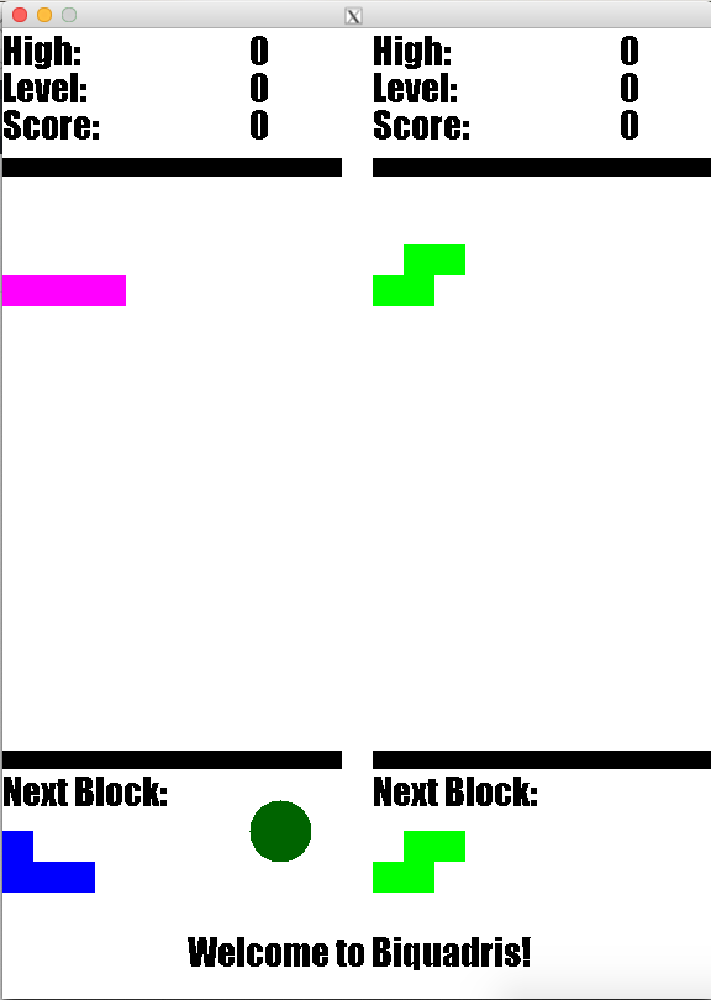
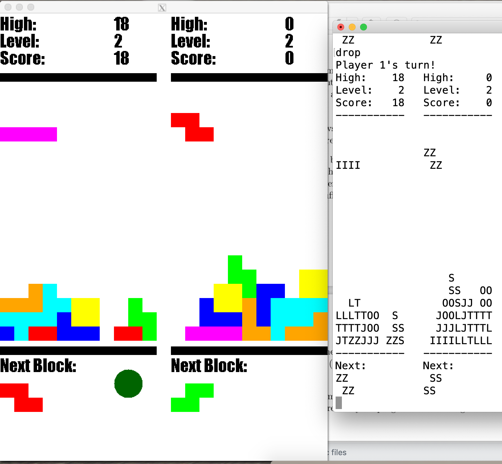
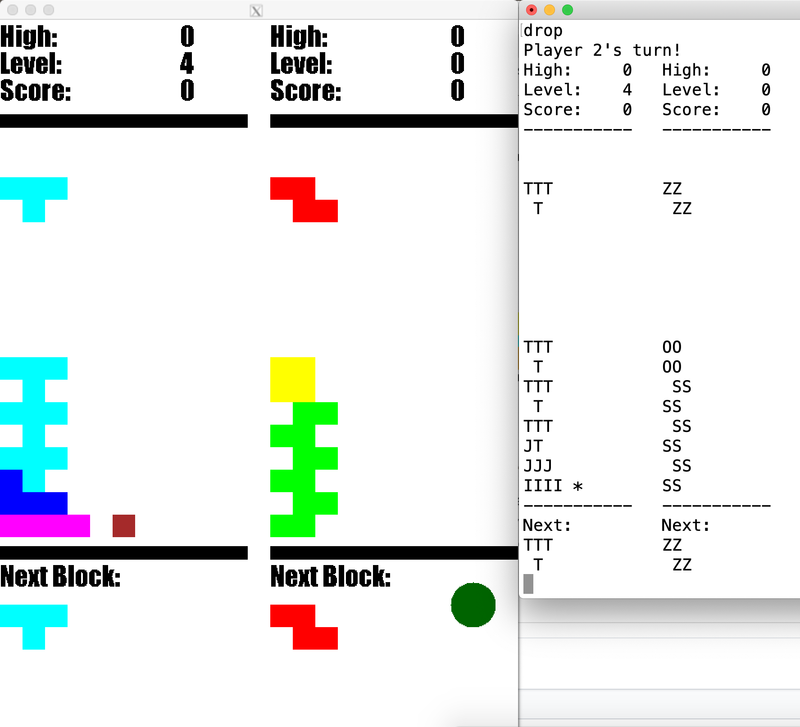
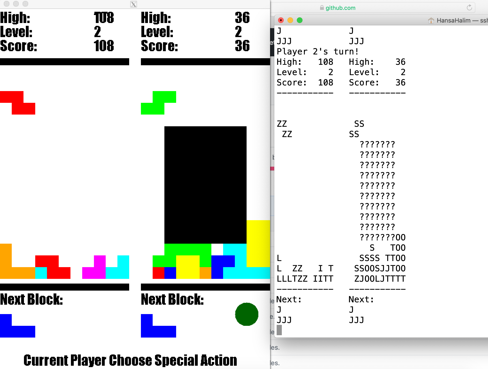

# Biquadris-Demo
This page to demonstrate the Biquadris Project which is the final project for CS 246. It received a final mark of 97.2
The source code is available to view upon request, but is not open to the public due to Policy 71 of the University of Waterloo.

A total of 57 .cc and .h files are used in this game where in most cases the class performs exactly 1 action, thus the code can be reused for other games that are quite similar and it minimizes recompilation if we were to modify a certain action.

The games has a graphical interface and a terminal text interface. Below is the graphical interface of the game

The text interface will always show up because we need the terminal window to input commands, but we can disable the graphical window to remove X11 graphics and make the game go faster (if you are on slow internet).

There are 4 levels programmed to this game with different probability settings on what blocks are going to be spawned next.
Level 3 and 4 is unique because every move or rotation to the block will face 1 down effect and level 4 makes it harder by adding a 1x1 square in the middle of the game after 5 moves if no block is cleared. The 1x1 block is brown in the graphical display and it is an asterisk in the text display.

The game also has special actions where they are triggered when you clear 2+ lines in a single drop of block. The effects are 'Blind' blinds the screen of the opponent. 'Heavy' causes the opponent to get 1 down on every block movements and rotations. 'Force' forces the opponent's current block to be a block that you choose.
Below is an example of Blind

